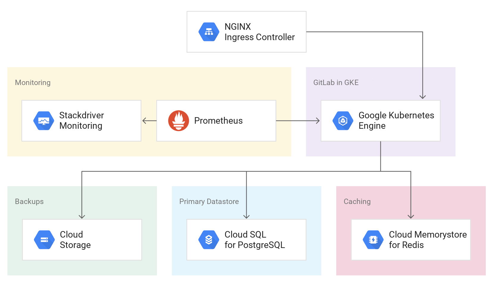

# GitLab Deployment on GKE
Clone this repository and run locally, or use Cloud Shell to walk through the steps:

## Prerequisites
* Google Cloud Platform project with valid billing account
* [Terraform](https://learn.hashicorp.com/terraform/getting-started/install.html)
* [Google Cloud SDK](https://cloud.google.com/sdk/install)

## Setup
This repository helps you spin up a resilient and fault tolerant GitLab 
installation using Google Kubernetes Engine (GKE) as the computing environment 
and the following services for storing data:
- CloudSQL for PostgreSQL
- Memorystore for Redis
- Cloud Storage

# Requirements

Before this module can be used on a project, you must ensure that the following pre-requisites are fulfilled:

1. Terraform is [installed](#software-dependencies) on the machine where Terraform is executed.
2. The Service Account you execute the module with has the right [permissions](#configure-a-service-account).

The [project factory](https://github.com/terraform-google-modules/terraform-google-project-factory) can be used to provision projects with the correct APIs active.

### Software Dependencies
### Terraform
- [Terraform](https://www.terraform.io/downloads.html) 0.12.x
- [terraform-provider-google](https://github.com/terraform-providers/terraform-provider-google) plugin v1.8.0

### Configure a Service Account
In order to execute this module you must have a Service Account with the
following project roles:
- roles/owner

## Install

### Terraform
Be sure you have the correct Terraform version (0.12.x), you can choose the binary here:
- https://releases.hashicorp.com/terraform/

